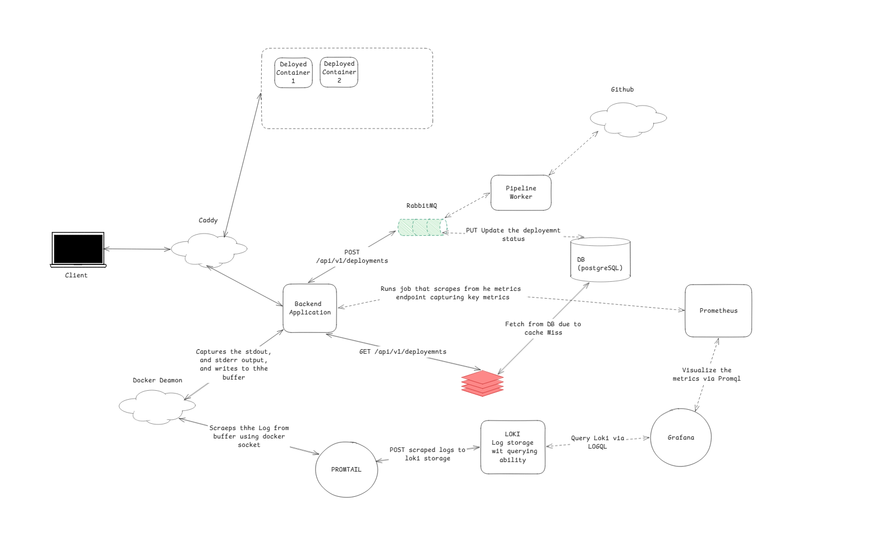
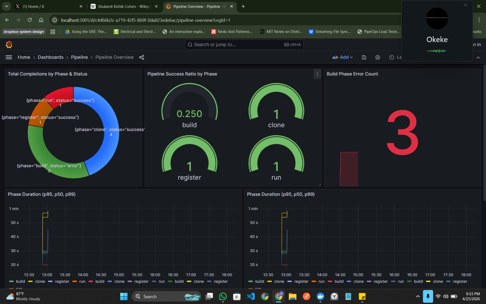
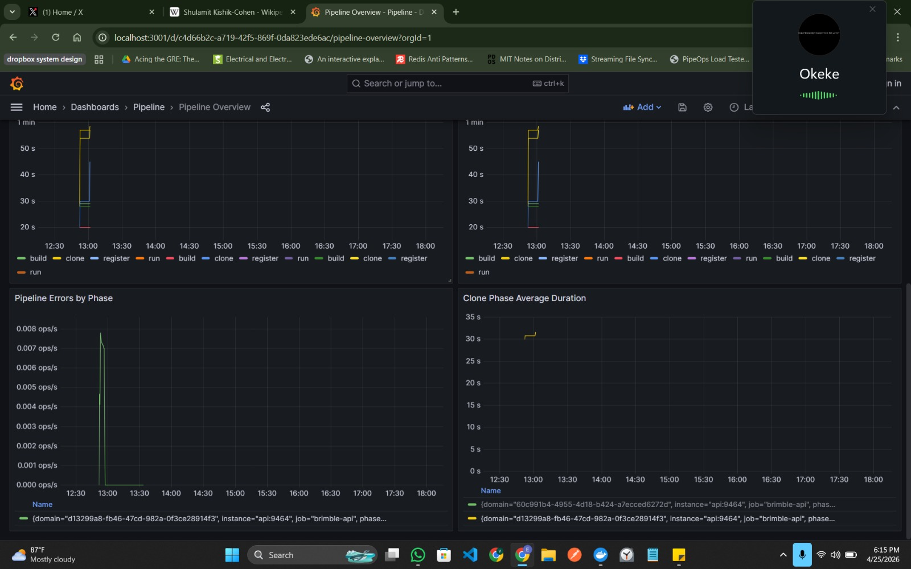

# brimble-paas

A self-hosted PaaS pipeline that accepts a Git URL or a project upload, builds a container image with Railpack, runs it with Docker, and routes traffic through Caddy. Built as part of the Brimble engineering take-home task.

---

## What I built

A miniature deployment platform that illustrate a little what Brimble does in production. A user submits a Git repository URL or uploads a project archive. The API kicks off a pipeline that clones the source, builds an OCI image with Railpack via BuildKit, starts the container, and registers a Caddy reverse-proxy route. Build and deploy logs stream to the UI in real time over SSE. Every deployment gets a live URL the moment the container is healthy.

---

## Functional requirements

- Submit a deployment from a Git URL or a file upload (zip, tar, gzip)
- Pipeline runs four ordered phases: clone > build > run > register
- Every phase emits log lines that stream live to the User Interface
- Logs persist to PostgreSQL so a user can scroll back after the build finishes
- Deployment status transitions: `pending > building > deploying > running > failed`
- Each deployment gets a unique host port and a Caddy-managed URL
- Dead-lettered jobs (exceeded max retries) are stored and resolvable via API
- Health check endpoint for the API and Caddy itself

---

## Non-functional requirements

- The entire stack comes up with `docker compose up` on a clean machine
- Log streaming is real time over SSE, not polling
- Failed deployments retry up to a configurable limit before dead-lettering
- Metrics exposed in Prometheus format and visualised in Grafana
- Structured JSON logs via Winston, shipped to Loki via Promtail
- Graceful shutdown: HTTP server closes, RabbitMQ disconnects, PostgreSQL pool drains
- Outbox pattern for reliable event publishing between the API and RabbitMQ

---

## Architecture


### Pipeline flow

```
POST /api/v1/deployments
  > API creates deployment record (status: pending)
  > Outbox poller publishes deployment.requested to RabbitMQ
  > Consumer picks up message
  > PipelineRunner.run()
      1 clone   (git clone or extract upload)
      2. build   (Railpack > BuildKit > OCI image)
      3 run     (docker run with allocated host port)
      4. register (Caddy admin API > add reverse proxy route)
  > Status transitions emitted at each phase
  > Logs written to PostgreSQL + published to Redis channel
  > SSE clients receive log lines and status updates in real time
```

---

## Technology decisions

### RabbitMQ as the job queue

I chose RabbitMQ over a simple in-process queue since the write path (deployment pipeline) is long-running and CPU-heavy. If the API restarts mid-build, an in-process queue will obviously lose the job. RabbitMQ with quorum queues and a dead-letter exchange gives me durable delivery and automatic retry with a configurable retry limit. When a job exceeds `MAX_RETRIES`, it lands in the dead-letter table with the full error history, where an operator can inspect and resolve it.

### Outbox pattern for reliable publishing

The usual approach is when the process writes the deployment to PostgreSQL we can then call `channel.publish()`, which is more of like a fire forget ops. If the producer publishehd message fails, the deployment exists in the DB but no worker ever processes it. I basically used the transactional outbox pattern to solve this issue: the deployment and the outbox event are written in the same transaction. A poller reads pending outbox rows and publishes them to RabbitMQ, marking them as published on success. This guarantees at-least-once delivery without distributed transactions.

### Redis caching

Fro frequently read resources like (deployment by ID, deployment lists, log reads for completed deployments) they are cached with short TTLs. The cache layer sits in this path `infra/cache/cache.client.ts` and wraps every operation with Prometheus instrumentation like the hit rate, miss rate, latency, and invalidation counts are all visible in Grafana. All cache errors are swallowed gracefully: a Redis failure degrades to a DB read rather than a 500.

### Why I moved from in-process EventEmitter to Redis pub/sub for log streaming

My first implementation for this task bsically made use of SSE log streaming using Node's `EventEmitter`. So the way it works is that, the pipeline worker emitted `log` and `status` events on a shared `deploymentEventBus` instance, and the SSE controller subscribed to them. This worked perfectly fine for me on a single instance. The pipeline worker and the SSE controller share the same process, so the event travels zero network hops.

The problem is that this breaks the moment you run two API instances. The RabbitMQ consumer picks up the deployment message on Instance 1. The user's browser opens an SSE connection to Instance 2. Instance 2's `EventEmitter` never receives the log events from Instance 1's pipeline worker. The SSE client receives nothing.

I moved to Redis pub/sub. After each log line is persisted to PostgreSQL, the repository publishes it to a Redis channel keyed by deployment ID (`brimble:logs:<deploymentId>`). Each SSE client gets a dedicated subscriber connection created with `redisClient.duplicate()`. I use `duplicate()` because once ioredis enters subscriber mode permanently when teh `subscribe()` method is called, a connection in the subscriber mode will not be able to issue any other command, including `GET`, `SET`, or `PUBLISH`. The cache connection and the subscriber connection must be completely independent.

The SSE controller subscribes before fetching existing logs from the DB. This ordering closes the race window: if a log line is published between the DB fetch and the subscribe call, it would be permanently missed. By subscribing first, those lines are buffered in ioredis and delivered after the catch-up fetch completes.

### What I would do with more time: Redis Streams

Redis pub/sub provides at-most-once delivery. A message is delivered to subscribers currently connected at the moment of publish. If no subscriber is listening, the message is gone. If an SSE client disconnects and reconnects mid-build, every line published during the disconnection window is permanently lost from Redis. The client re-fetches from PostgreSQL on reconnect which recovers the lost lines, but it costs a DB read on every reconnect and breaks the SSE id: ordering guarantee.

In theh case of Redis Streams, it will definitely provide me at-least-once delivery. Lines are written to the stream with XADD and persist until explicitly trimmed. A client that disconnects and reconnects calls XREAD COUNT 1000 STREAMS brimble:logs:<id> <lastId> where lastId is taken from the SSE Last-Event-ID header the browser sends automatically. The server replays exactly the lines that were missed, no DB round-trip involved. If the same line is delivered twice due to a crash between delivery and acknowledgement, the client deduplicates by sequence number. A duplicate is harmless. A missing line is not.
Redis Streams (`XADD` / `XREAD BLOCK`) would give me at-least-once delivery with replay. The stream entry ID maps directly to the SSE `Last-Event-ID` header. On reconnect the browser sends the last received event ID and the server issues `XREAD COUNT 1000 STREAMS brimble:logs:<id> <lastId>` to replay exactly what was missed - no DB involved. Consumer groups let multiple API instances fan out stream entries without duplication.

### The Docker socket problem

The pipeline needs to build images via BuildKit and start containers via Docker. Inside a Docker Compose network, the API container needs access to the host Docker daemon. I mount `/var/run/docker.sock` into the API container. The socket is owned by the `docker` group on the host and the API container gets `permission denied` when connecting as a non-root user. The current `docker-compose.dev.yml` runs the API container as `user: root` to work around this.

This is a known security trade-off for development: a container with root access to the Docker socket has effective root on the host. In production I would put a `docker-socket-proxy` in front of the socket that whitelists only the specific Docker API calls the pipeline needs (image build, container create, container start, container inspect), or use BuildKit's rootless daemon which avoids the privileged socket entirely.

---

## API design

### Deployments

| Method | Path | Description |
|--------|------|-------------|
| `POST` | `/api/v1/deployments` | Create a deployment (git or upload) |
| `GET` | `/api/v1/deployments` | List all deployments |
| `GET` | `/api/v1/deployments/:id` | Get deployment by ID |
| `GET` | `/api/v1/deployments/:id/logs` | SSE stream of live logs and status |

### Deployment logs

| Method | Path | Description |
|--------|------|-------------|
| `GET` | `/api/v1/deployment-logs` | Paginated logs for a deployment |
| `GET` | `/api/v1/deployment-logs/count` | Total log count for a deployment |

### Dead letters

| Method | Path | Description |
|--------|------|-------------|
| `GET` | `/api/v1/dead-letters` | List unresolved dead-lettered jobs |
| `GET` | `/api/v1/dead-letters/:jobId` | Get a dead letter by job ID |
| `PATCH` | `/api/v1/dead-letters/:jobId/resolve` | Mark a dead letter as resolved |

### SSE event types

```
event: log      > { deploymentId, seq, ts, line, phase }
event: status   > { deploymentId, status }
event: done     > { status: "running" | "failed" }
: heartbeat     > sent every 15s to keep the connection alive through proxies
```

---

## Project structure

```
brimble-paas/
├── app/
│   ├── api/                          # Backend API
│   │   ├── src/
│   │   │   ├── domains/
│   │   │   │   ├── deployment/       # deployment entity, pipeline runner, service, repository
│   │   │   │   │   ├── pipeline/     # PipelineRunner + phase implementations (clone, build, run, register)
│   │   │   │   │   └── events/       # deploymentEventBus (legacy in-process, superseded by pub/sub)
│   │   │   │   ├── deployment-log/   # log persistence, SSE controller, paginated reads
│   │   │   │   ├── dead-letter/      # dead letter creation, resolution, outbox integration
│   │   │   │   └── outbox/           # transactional outbox repository and poller
│   │   │   ├── infra/
│   │   │   │   ├── cache/            # Redis cache client with Prometheus instrumentation
│   │   │   │   ├── config/           # Redis and PostgreSQL connection management
│   │   │   │   ├── db/               # pg Pool singleton with pool event instrumentation
│   │   │   │   ├── messaging/        # RabbitMQ connection, producer, consumers, topology
│   │   │   │   ├── migrations/       # SQL migration files
│   │   │   │   ├── middleware/       # request ID, validation, error handler, upload
│   │   │   │   ├── pubsub/           # Redis pub/sub publisher and subscriber
│   │   │   │   └── sse/              # SSE response helpers
│   │   │   └── shared/
│   │   │       ├── utils/            # metrics, logger, error types, outbox poller
│   │   │       ├── constants.ts
│   │   │       └── types.ts
│   │   ├── src/__tests__/
│   │   │   ├── unit/                 # repository and service unit tests
│   │   │   ├── integration/          # route integration tests against real PostgreSQL
│   │   ├── Dockerfile
│   │   ├── package.json
│   │   └── tsconfig.json
│   │
│   └── ui/                           # Frontend - Vite + TanStack
│       ├── src/
│       │   ├── routes/               # TanStack Router file-based routes
│       │   │   └── index.tsx         # single dashboard page
│       │   ├── components/
│       │   │   ├── layout/           # AppShell, sidebar, header
│       │   │   └── ui/               # shadcn/ui primitives
│       │   ├── hooks/                # TanStack Query hooks for deployments and logs
│       │   ├── lib/
│       │   │   └── api.ts            # API client - base URL is /api/v1 (same origin via Caddy)
│       │   └── types/
│       ├── Dockerfile
│       ├── package.json
│       └── vite.config.ts
│
├── brimble-deploy/                   # Docker Compose stack and observability config
│   ├── grafana/                      # dashboard provisioning and JSON dashboards
│   ├── loki/                         # Loki config
│   ├── prometheus/                   # Prometheus scrape config
│   ├── promtail/                     # Promtail config for Docker log collection
│   ├── rabbitmq/                     # RabbitMQ definitions, plugins, config
│   ├── Caddyfile
│   └── docker-compose.dev.yml
├── .env.sample
└── README.md
```

---

## Prerequisites

- Docker Desktop (or Docker Engine + Docker Compose v2)
- The Docker daemon must be running before `docker compose up`
- No other services needed — everything else runs inside the compose network

---

## Installation and setup

### 1. Clone the repository

```bash
git clone https://github.com/edidiesky/brimble-paas
cd brimble-paas
```

### 2. Configure environment variables

```bash
cp .env.sample brimble-deploy/.env
```

The `.env.sample` contains sensible defaults for every variable. The only values you must change before starting are the RabbitMQ credentials — the defaults will work but you should generate a proper password hash for `definitions.json`.

### 3. Generate RabbitMQ password hash

RabbitMQ requires a hashed password in its definitions file, not a plaintext one. Generate the hash for whatever password you set as `RABBITMQ_PASS` in your `.env`:

```bash
docker run --rm rabbitmq:3.13-management-alpine \
  rabbitmqctl hash_password YOUR_RABBITMQ_PASS
```

Open `brimble-deploy/rabbitmq/definitions.json`, find the `users` array, and replace the `password_hash` value with the output of that command. The plaintext password in `.env` and the hash in `definitions.json` must correspond.

### 4. Start the stack

```bash
cd brimble-deploy
docker compose -f docker-compose.dev.yml up -d --build
```

On first run Docker pulls all images and builds the API and UI containers. This takes 3–5 minutes depending on your connection. The UI is built at compose time — Caddy serves the static output directly. Subsequent runs are fast since layers are cached.

### 5. Verify everything is running

| Service | URL | Notes |
|---------|-----|-------|
| UI | http://localhost | Main dashboard |
| API health | http://localhost/api/v1/health | Should return `{ status: "ok" }` |
| API direct | http://localhost:3000/health | Direct port access |
| Metrics | http://localhost:9464/metrics | Prometheus scrape endpoint |
| RabbitMQ | http://localhost:15672 | Management UI — credentials from `.env` |
| Grafana | http://localhost:3001 | Dashboards — credentials from `.env` |
| Prometheus | http://localhost:9090 | Query UI |

### 6. Submit a test deployment

Once the stack is healthy, submit a deployment from the UI or via curl:

```bash
curl -X POST http://localhost/api/v1/deployments \
  -H "Content-Type: application/json" \
  -d '{
    "sourceType": "git",
    "sourceRef": "https://github.com/edidiesky/brimble-ui",
    "name": "my-app"
  }'
```

The UI will show the deployment appearing with status `pending`, transitioning through `building` and `deploying`, and reaching `running` with a live URL once Caddy registers the route. Build logs stream to the UI in real time as each pipeline phase executes.

### Stopping the stack

```bash
docker compose -f docker-compose.dev.yml down
```

To also remove volumes (wipes all data including PostgreSQL and Redis):

```bash
docker compose -f docker-compose.dev.yml down -v
```

## Running tests

### Unit tests

No Docker required. Uses full mocks for all infrastructure.

```bash
cd app/api
npm run test:unit
```

### Integration tests

Requires Docker running. Testcontainers starts a real PostgreSQL 16 container, applies migrations, runs all tests, and tears down the container automatically.

```bash
cd app/api
npm install --save-dev @testcontainers/postgresql testcontainers @types/pg
npm run test:integration
```

First run is slow (~15s) while Docker pulls the PostgreSQL image. Subsequent runs use the cached image (~6s).

---

## Test strategy

I followed a 70/20/10 distribution:

**Unit tests (70%)** cover the repository and service layers in full isolation. Every external dependency - PostgreSQL pool, Redis cache, RabbitMQ producer, metrics - is mocked at the module boundary. The tests assert business logic: cache invalidation only happens after `COMMIT` not inside a transaction, `publishLog` is not called when `ON CONFLICT DO NOTHING` returns zero rows, dead-letter creation rolls back and does not invalidate cache on DB error.

**Integration tests (20%)** run against a real PostgreSQL container via testcontainers. No mocking of the database layer. The tests assert the full HTTP request/response cycle plus DB state: a `POST /deployments` creates a row with `status = pending` regardless of what the caller sends, a `PATCH /dead-letters/:jobId/resolve` sets `resolved_by = system` in the actual row. RabbitMQ, Redis, and metrics are mocked at the module level to keep the tests focused on HTTP and DB correctness.

**Load tests (10%)** use k6 with a ramping VU scenario: 60% deployment creates, 25% log reads, 15% dead-letter list reads. Thresholds: p95 create latency under 1000ms, p95 read latency under 500ms, error rate under 1%. I did left it out since thhere was no time to comlete it.

---

## Observability

### HTTP Dashboard


### Pipeline Dashboard



Grafana dashboards cover seven areas:

- **HTTP** - request rate, error rate, p50/p95/p99 latency, requests by route and status code
- **Pipeline** - phase duration p95, error rate by phase, success ratio per phase
- **Cache** - hit rate by domain, miss rate, latency, invalidation counts
- **Database** - query duration p95 by operation, error rate, slow query alerts, pg pool checkout latency, pool size and waiting count
- **Infrastructure** - CPU, heap utilisation, event loop lag, GC duration, open file descriptors
- **Workers** - task throughput by topic, error rate, queue depth
- **Errors** - error rate by domain and severity, critical error rate

Logs are shipped to Loki via Promtail which tails Docker container logs. Every log line is structured JSON with `event`, `service`, `domain`, and `requestId` fields for correlation.

---

## What I would do with another weekend

**Redis Streams for at-least-once log delivery.** The current Redis pub/sub is fire-and-forget. A client that disconnects mid-build misses lines published during the disconnection. Redis Streams with `XREAD BLOCK` and `Last-Event-ID` replay would give exact replay from any point with no DB round-trip.

**Rate limiting with dynamic rule configuration.** Per-resource rate limits configurable at runtime via Redis, not hardcoded in middleware. Different limits for deployment creates (expensive, build-heavy) vs log reads (cheap, read-heavy). Circuit breaker per downstream dependency (BuildKit, Caddy admin API) with exponential backoff.

**Worker threads for clone and build phases.** The clone and build phases are CPU and I/O bound. Running them in the main event loop blocks the API for other requests during heavy builds. Moving them to worker threads via `worker_threads` would keep the event loop free during pipeline execution.

**Async status transitions via events.** Currently the pipeline runner updates deployment status synchronously inline. Emitting status change events to a dedicated RabbitMQ exchange would decouple status persistence from the pipeline execution path and make the status flow auditable.

**Zero-downtime redeploys.** When a redeployment is triggered for an existing deployment, start the new container before stopping the old one. Update the Caddy route atomically once the new container passes a health check. The old container is stopped only after traffic is flowing to the new one.

**docker-socket-proxy.** Replace the raw Docker socket mount with a proxy that whitelists only the specific Docker API calls the pipeline needs. Removes the effective root-on-host security risk from running the API container as root.

**Nomad for orchestration.** For a production deployment across multiple Hetzner and DigitalOcean nodes, Nomad would replace the manual Docker container management. Each deployment becomes a Nomad job. Consul handles service discovery and health checking. The Caddy admin API integration stays the same - Nomad reports the allocated port, Caddy adds the route.

---

## Rough time spent

Three days. Day one was infrastructure setup - Docker Compose, RabbitMQ topology, BuildKit integration, database schema and migrations. Day two was the pipeline runner, SSE streaming, and the move from in-process EventEmitter to Redis pub/sub. Day three was observability (Prometheus, Grafana, Loki), the cache layer, tests, and documentation.

---

## Sample app for testing

Use [edidiesky/brimble-ui](https://github.com/edidiesky/brimble-ui) or any public Node.js, Python, or Go repository. Submit the Git URL through the UI or via:

```bash
curl -X POST http://localhost:3000/api/v1/deployments \
  -H "Content-Type: application/json" \
  -d '{
    "sourceType": "git",
    "sourceRef": "https://github.com/edidiesky/brimble-ui",
    "name": "my-app"
  }'
```

Watch the SSE stream at `GET /api/v1/deployments/:id/logs` or open the UI at the frontend URL.